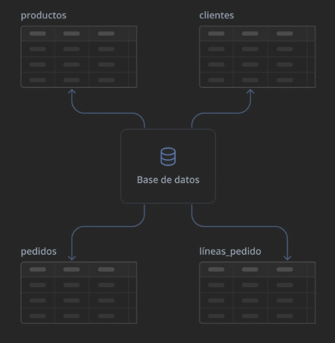
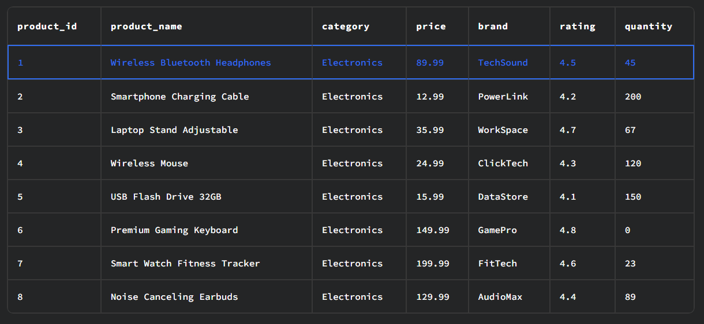
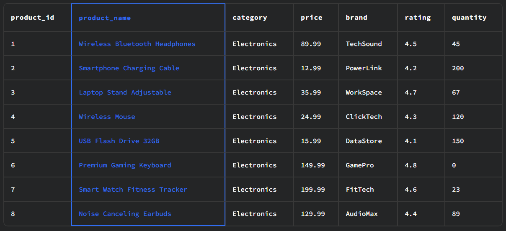

# Fundamentos de SQL
## Que son las Bases de Datos?
Una base de datos es un **contenedor organizado de información**. No es solo un montón de datos lanzados al azar; están estructurados de tal forma que una computadora (usando SQL) pueda encontrar, cambiar o borrar cualquier pieza de información en milisegundos.

Piénsalo así:

- No es una base de datos: Una caja de zapatos llena de recibos mezclados.
- Sí es una base de datos: Un archivero de oficina perfectamente etiquetado, donde cada carpeta tiene un lugar específico y un formato estándar.

Para este caso estamos aprendiendo **Bases de Datos relacionales** ya que existen Bases de Datos No Relacionales **No SQL**;

**SQL:** *Las Bases de Datos Relacionales*
Son las que hemos estado platicando. Imagina un estante de archivos perfectamente etiquetado donde cada documento debe tener el mismo formato.

- *Estructura:* Usan tablas con filas y columnas (como Excel pro).
- *Reglas:* Tienen un "esquema" fijo. Si decides que la columna "Edad" es un número, no puedes meterle un texto.
- *Relaciones:* Su superpoder es conectar tablas (ej. conectar la tabla de Ventas con la de Productos).

**Ejemplos:** PostgreSQL, MySQL, SQL Server, Oracle.

**NoSQL:** *Las Bases de Datos No Relacionales*
Imagina una caja gigante donde avientas carpetas. Cada carpeta puede tener cosas diferentes: una tiene tres hojas, otra tiene una foto y una servilleta escrita. Son mucho más flexibles.

- *Estructura:* No usan tablas. Usan documentos (parecidos a un archivo JSON), pares de "llave-valor" o incluso grafos.
- *Flexibilidad:* No tienen un esquema fijo. Hoy puedes guardar un usuario con "Nombre" y mañana otro con "Nombre", "Apodo" y "Redes Sociales" sin que el sistema explote.
- *Escalabilidad:* Son geniales para manejar volúmenes masivos de datos que cambian todo el tiempo (como los posts de Twitter o Facebook).

**Ejemplos:** MongoDB, Cassandra, Redis.

## Ejemplo de una Base de Datos Relacional.
Lo mas comun para aprender es con un contexto comercial(e-comerce), a continuacion vemos una base de datos de una tienda en linea como ejemplo.

Te muestro un ejemplo de una tabla, estas estas constituidas por filas y columnas, de estamanera organizamos la informacion.

En este ejemplo vemos una **Fila**, la cual esta resaltada de color azul, este es un registro de un producto con toda su informacion.

Ahora las columnas, estas representan un atributo del registro, en este ejemplo vemos el nombre de cada producto.

*En las siguiente carpeta te muestro a hacer consultas de SQL para comunicarte con las BD.*
